---
## Front matter
lang: ru-RU
title: "Внешний курс"
subtitle: "Выполнение внешнего курса. Основы Linux. Раздел 1"
author: 
  -  Сокирка Анна Константиновна 
institute: 
  - Российский университет дружбы народов, Москва, Россия
date: \today

## Formatting pdf
toc: false
toc-title: Содержание
slide_level: 2
aspectratio: 169
section-titles: true
theme: metropolis
header-includes:
  - \metroset{progressbar=frametitle,sectionpage=progressbar,numbering=fraction}
---
## Цель

Познакомиться с системой Linux и её базовыми возможностями.

## Задание

Выполнить упражнения и тесты из первого раздела курса.

## Раздел 1.1 — Основы

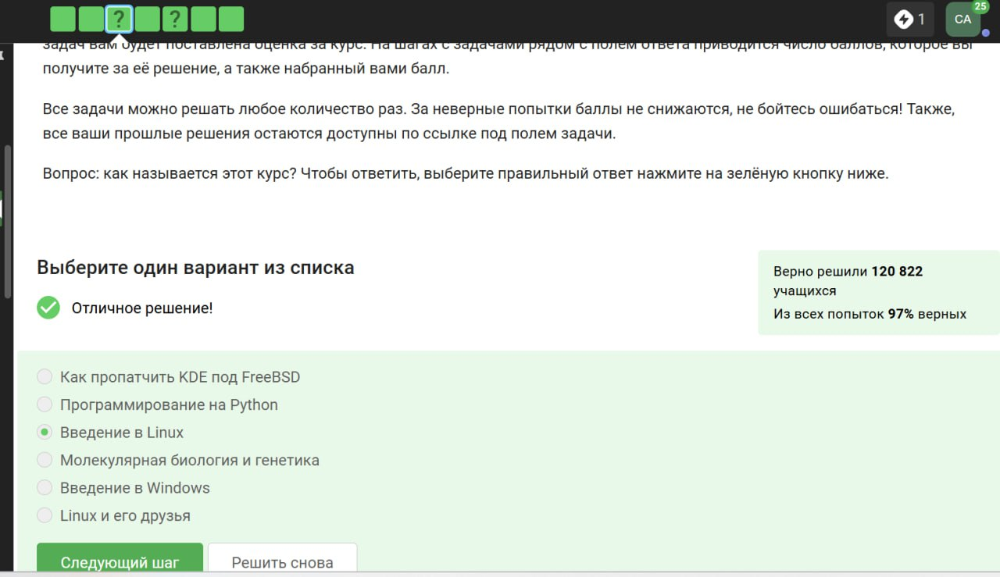{#fig:001 width=70%}

## Раздел 1.1 — Окружение

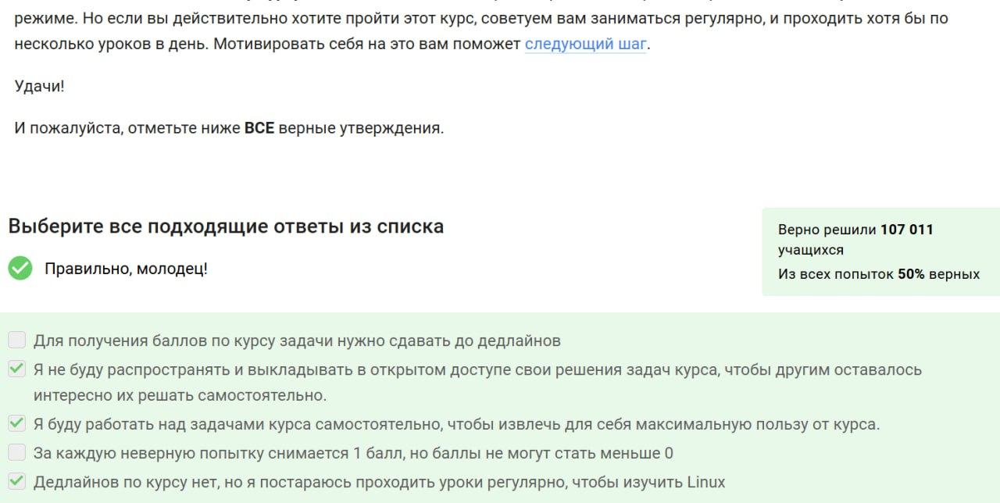{#fig:002 width=70%}

## Раздел 1.2 — ОС и виртуализация

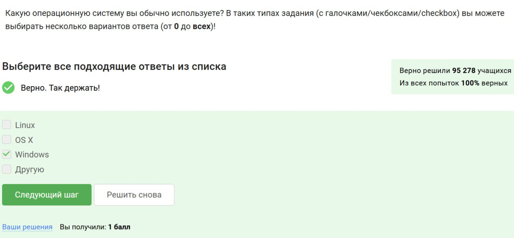{#fig:003 width=70%}

## Раздел 1.2 — Виртуальные машины

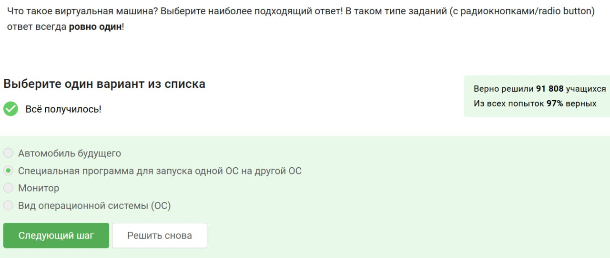{#fig:004 width=70%}

## Раздел 1.2 — Запуск Linux

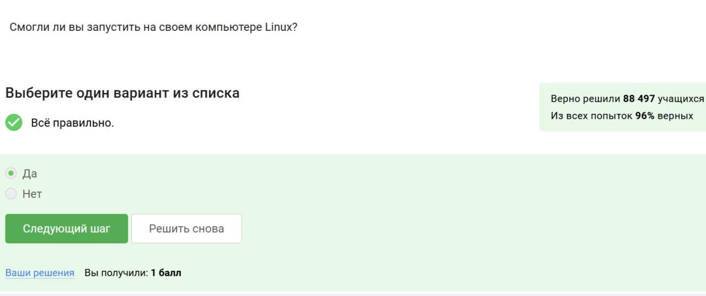{#fig:005 width=70%}

## Раздел 1.3 — Пакеты

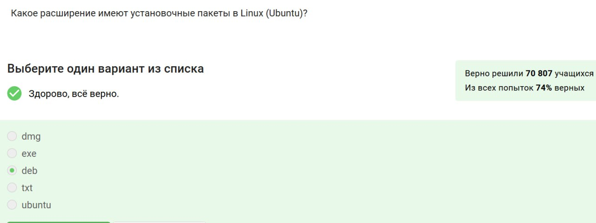{#fig:006 width=70%}

## Раздел 1.3 — Авторы ПО

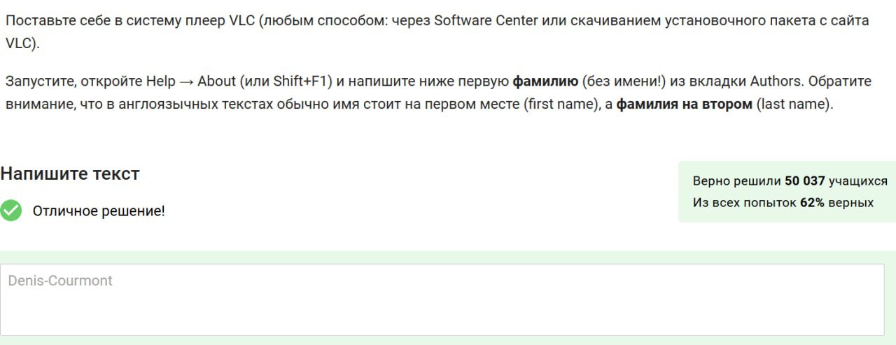{#fig:007 width=70%}

## Раздел 1.3 — Обновления

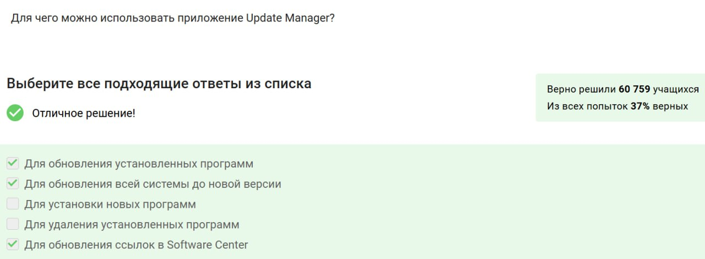{#fig:008 width=70%}

## Раздел 1.4 — Терминал

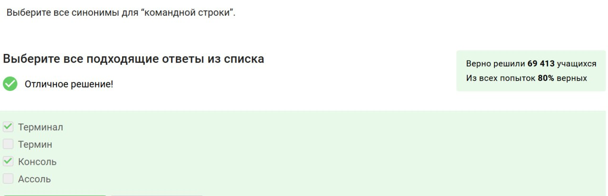{#fig:009 width=70%}

## Раздел 1.4 — Команда `pwd`

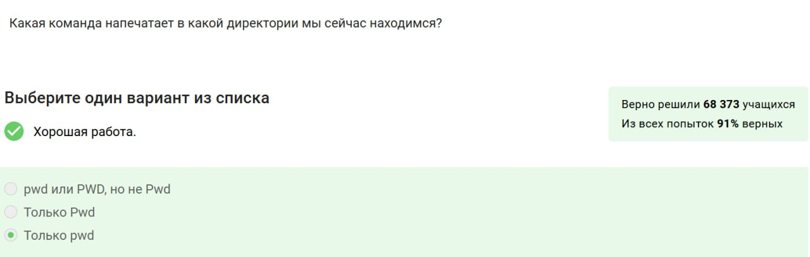{#fig:010 width=70%}

## Раздел 1.4 — Опции `ls`

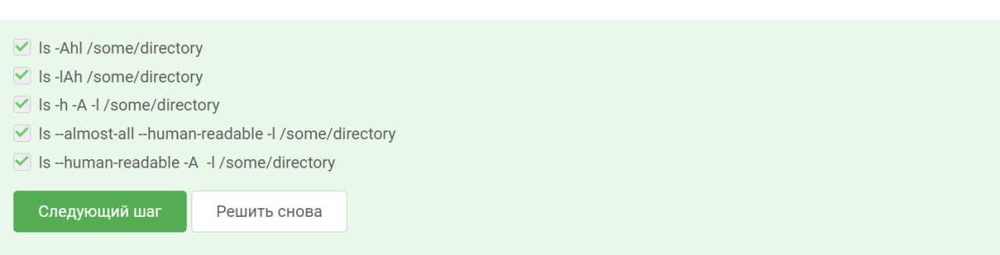{#fig:011 width=70%}

## Раздел 1.4 — Переход по папкам

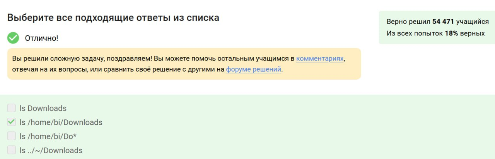{#fig:012 width=70%}

## Раздел 1.4 — Удаление

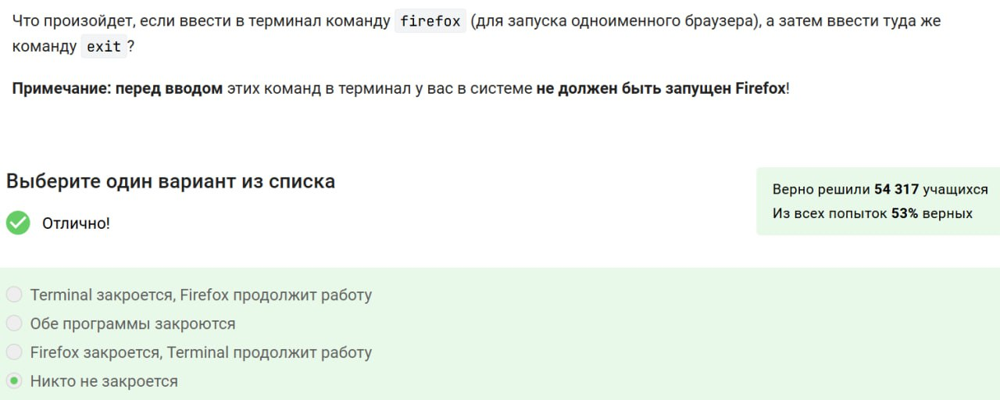{#fig:013 width=70%}

## Раздел 1.5 — Фоновые процессы

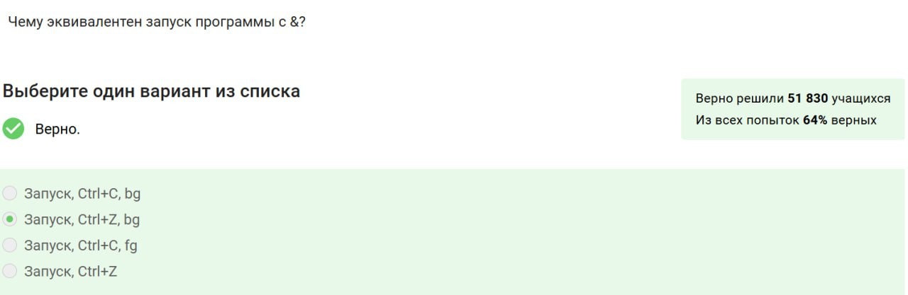{#fig:014 width=70%}

## Раздел 1.5 — Управление

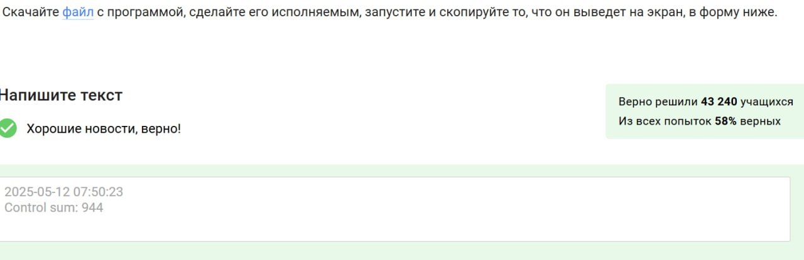{#fig:015 width=70%}

## Раздел 1.5 — Исполнение

{#fig:016 width=70%}

## Раздел 1.6 — Потоки ошибок

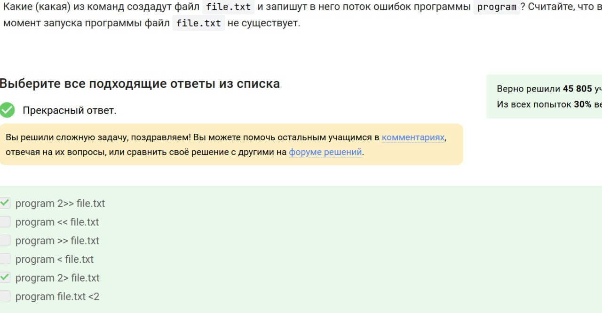{#fig:017 width=70%}

## Раздел 1.6 — Перенаправление

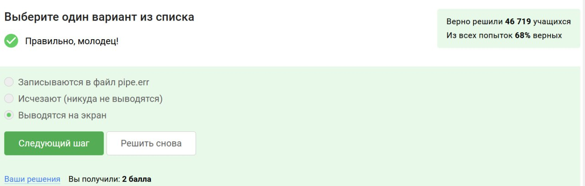{#fig:018 width=70%}

## Раздел 1.6 — Ошибки в пайплайне

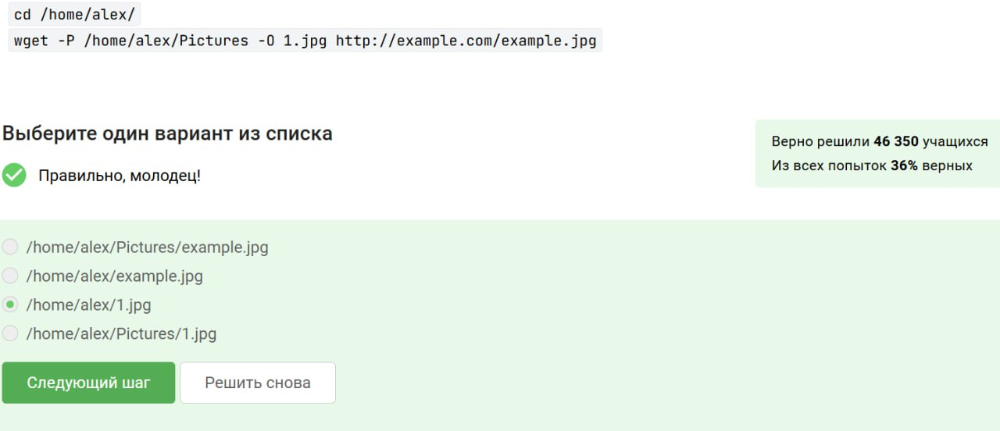{#fig:019 width=70%}

## Раздел 1.7 — wget

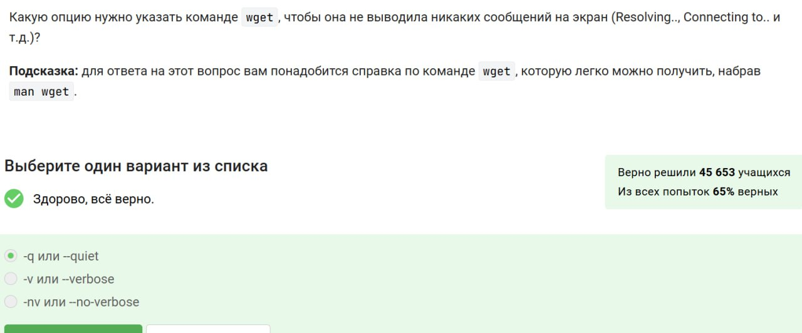{#fig:020 width=70%}

## Раздел 1.7 — Тихий режим

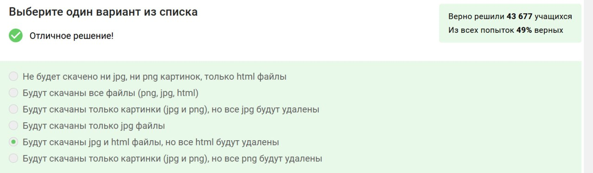{#fig:021 width=70%}

## Раздел 1.7 — Фильтрация

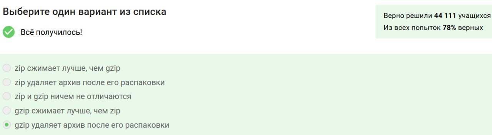{#fig:022 width=70%}

## Раздел 1.8 — Архивация

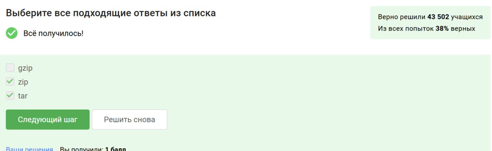{#fig:023 width=70%}

## Раздел 1.8 — Папки

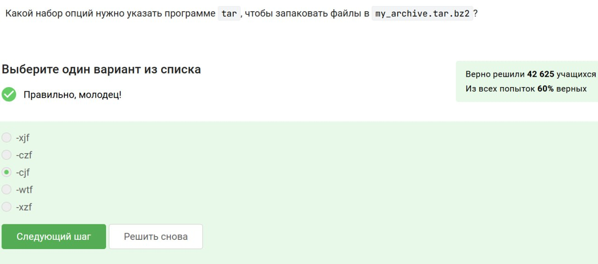{#fig:024 width=70%}

## Раздел 1.8 — tar.bz2

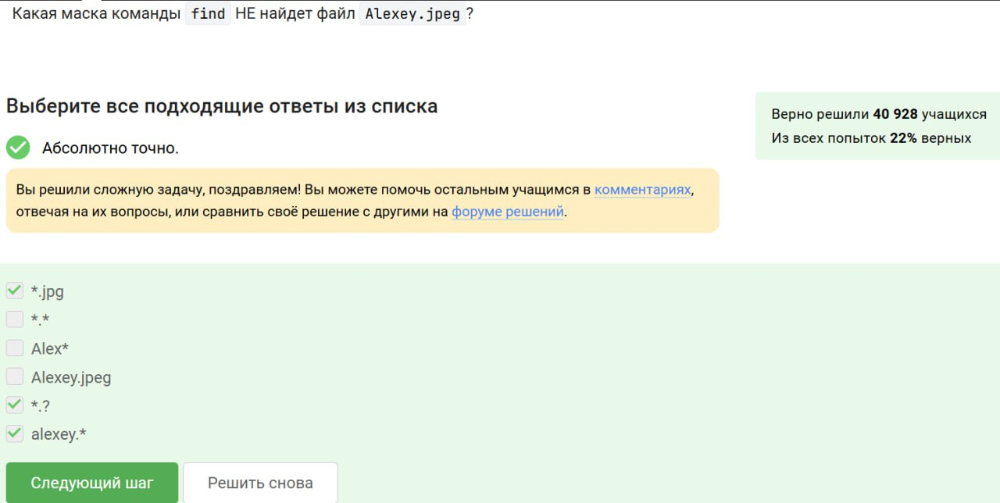{#fig:025 width=70%}

## Раздел 1.9 — Маски

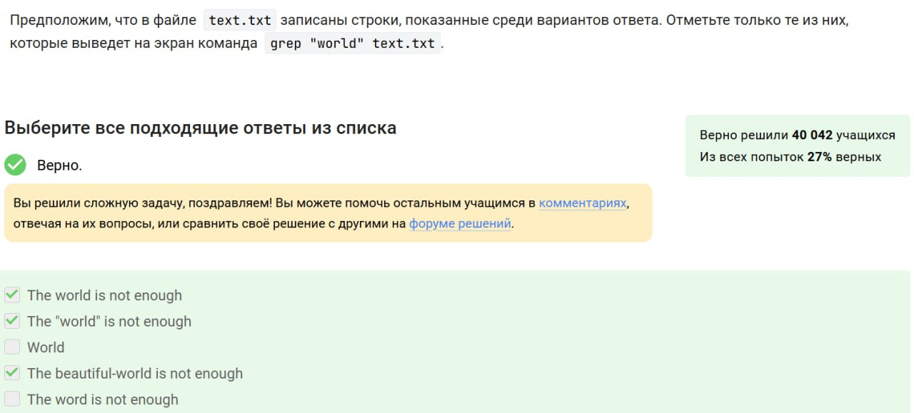{#fig:026 width=70%}

## Раздел 1.9 — Поиск grep

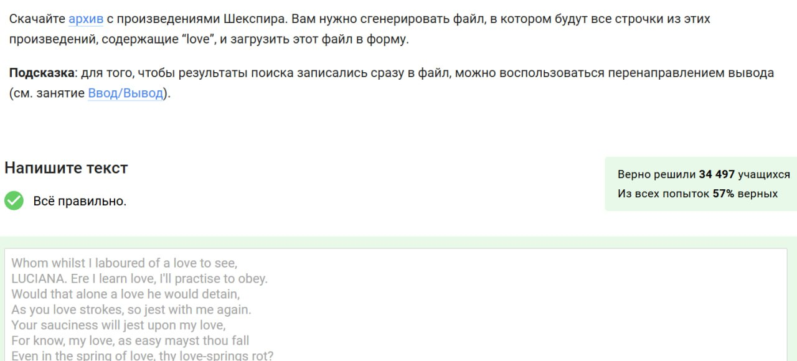{#fig:027 width=70%}

## Раздел 1.9 — Вывод grep

{#fig:028 width=70%}

## Выводы

Пройден первый раздел курса по Linux. Получены базовые знания и навыки работы с системой, терминалом и утилитами.