# Цель работы

Получить общее представление о системе Linux и её базовых возможностях.

# Задание

Пройти все предложенные тесты и упражнения в первом разделе курса.

# Выполнение лабораторной работы

## Раздел 1.1

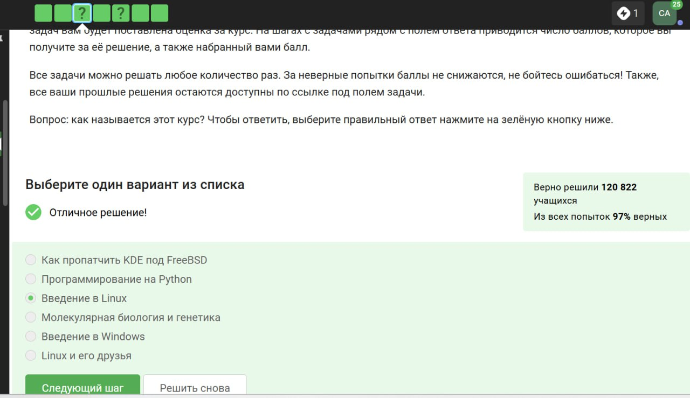{#fig:001}

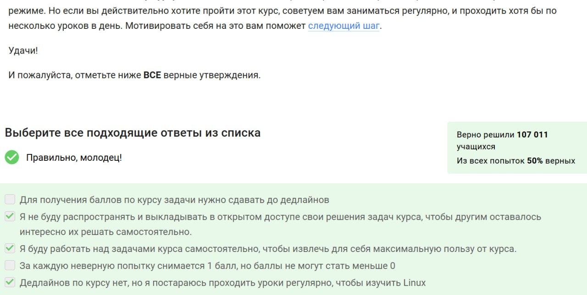{#fig:002}

Задания из этого раздела выполняются автоматически и не требуют отдельного пояснения.

## Раздел 1.2

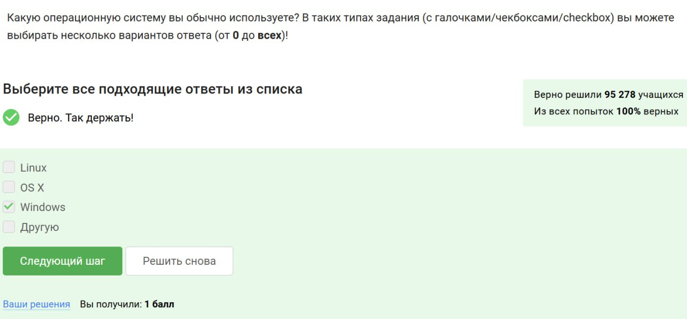{#fig:003}

Даже изучая Linux, пользователи могут применять другие ОС — например, запускать Linux в виртуальной машине из-под Windows.

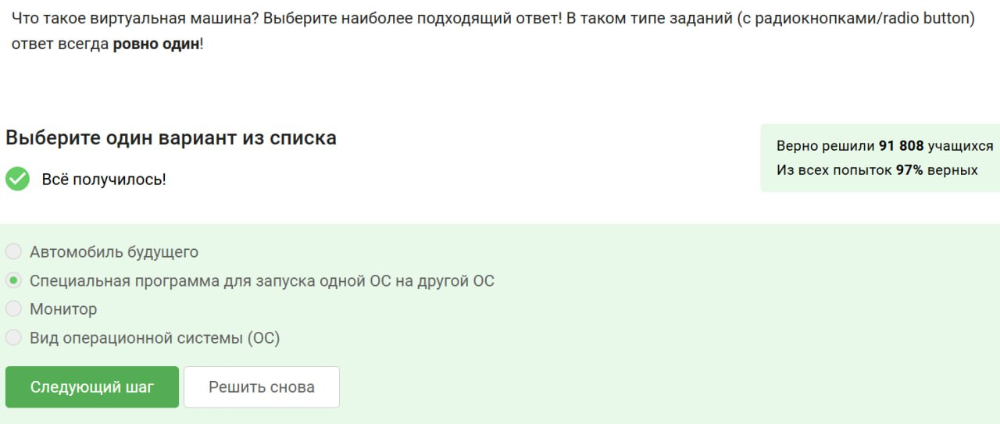{#fig:004}

Данный ответ полностью соответствует понятию виртуальной машины. Остальные утверждения не имеют смысла в данном контексте.

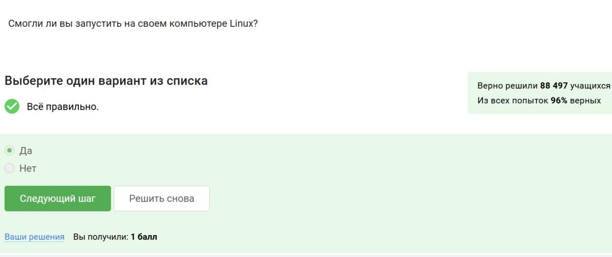{#fig:005}

Корректный запуск Linux-среды свидетельствует об успешном выполнении необходимых действий.

## Раздел 1.3

{#fig:006}

Пакеты .deb характерны для Ubuntu. Остальные расширения относятся к другим ОС или не применимы.

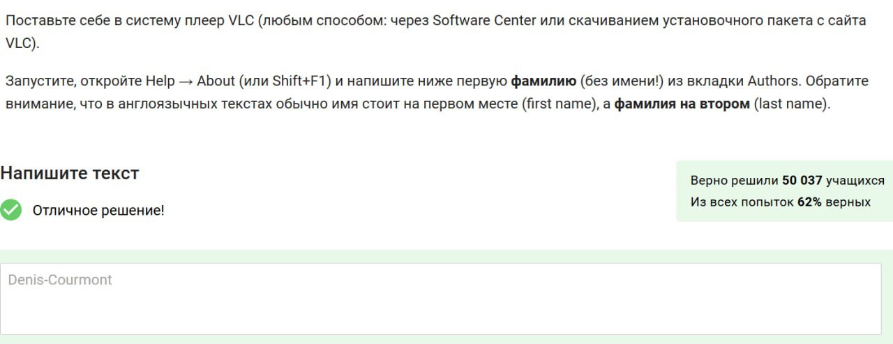{#fig:007}

Фамилия разработчика была найдена в разделе Authors программы VLC, как требовалось.

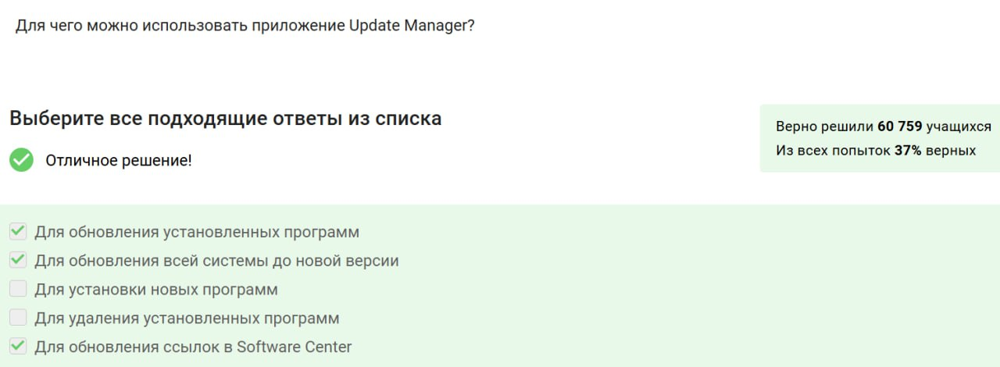{#fig:008}

Update Manager отвечает за установку обновлений — установка новых программ осуществляется через Software Center.

## Раздел 1.4

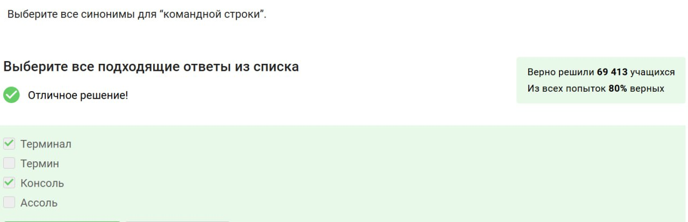{#fig:009}

В Linux термины "консоль" и "терминал" — синонимичны, в отличие от прочих вымышленных слов.

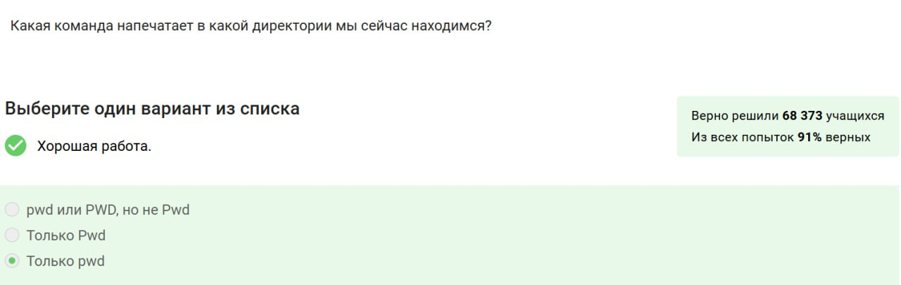{#fig:010}

Команда `pwd` выводит путь к текущей директории. Важно использовать правильный регистр.

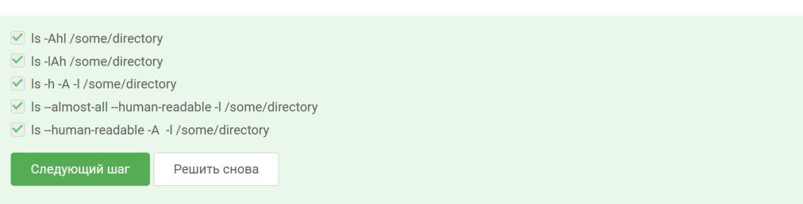{#fig:011}

Комбинированные опции позволяют отобразить скрытые файлы, размер в удобной форме и полную информацию о файлах.

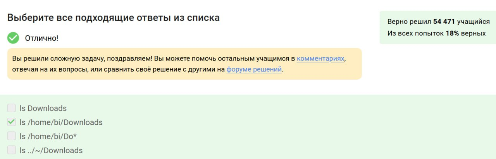{#fig:012}

Здесь продемонстрирован переход в папку Downloads с использованием относительного пути.

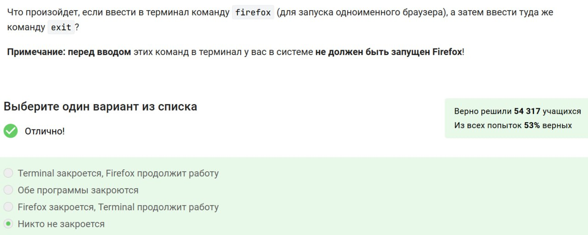{#fig:013}

Удаление каталога и его содержимого происходит при помощи команды `rm -r`.

## Раздел 1.5

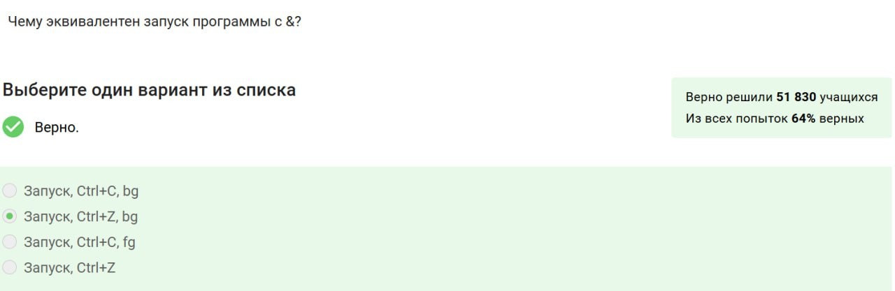{#fig:014}

Выход из терминала не завершает процессы, запущенные в фоне (например, Firefox).

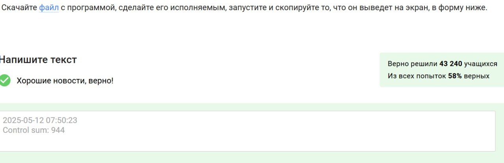{#fig:015}

Комбинация Ctrl+Z и последующая команда `bg` позволяет продолжить выполнение процесса в фоновом режиме.

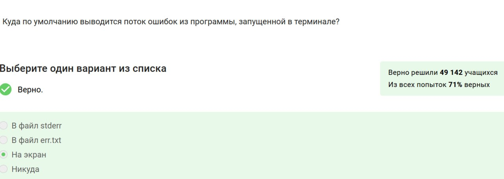{#fig:016}

Результат работы исполняемого файла был корректно выведен и зафиксирован.

## Раздел 1.6

{#fig:017}

Ошибки по умолчанию отображаются в терминале, если не перенаправлены специально.

{#fig:018}

Команда `2>` направляет ошибки в указанный файл, при этом файл создаётся автоматически.

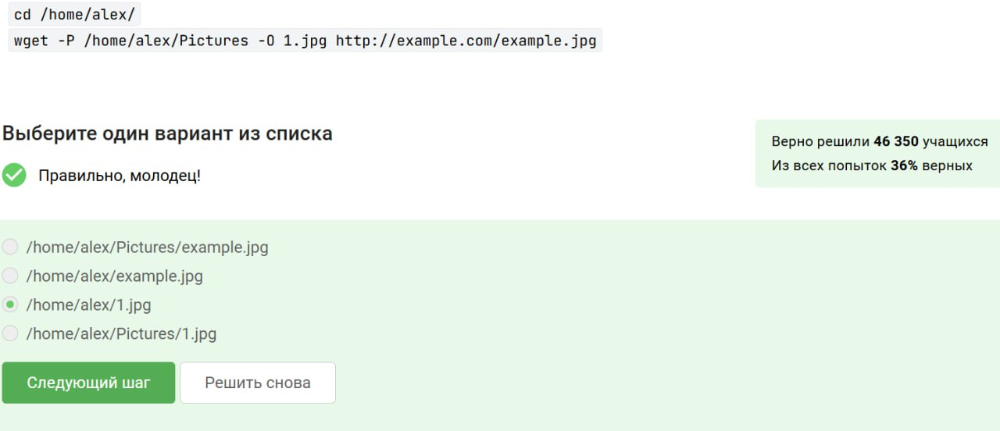{#fig:019}

Ошибочные сообщения в пайплайне не обрабатываются следующими командами и выводятся отдельно.

## Раздел 1.7

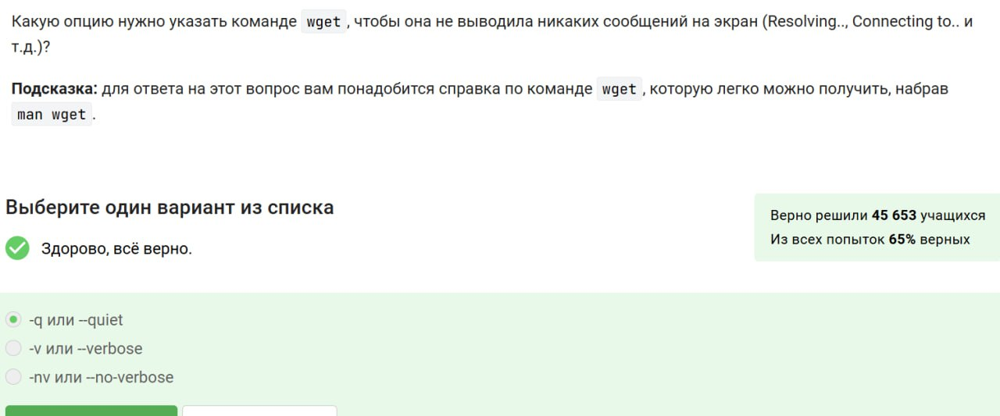{#fig:020}

Опции позволяют задать имя сохраняемого файла и директорию назначения.

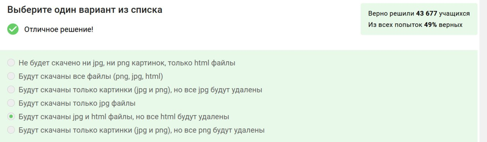{#fig:021}

Опция `-q` отключает вывод служебной информации при загрузке.

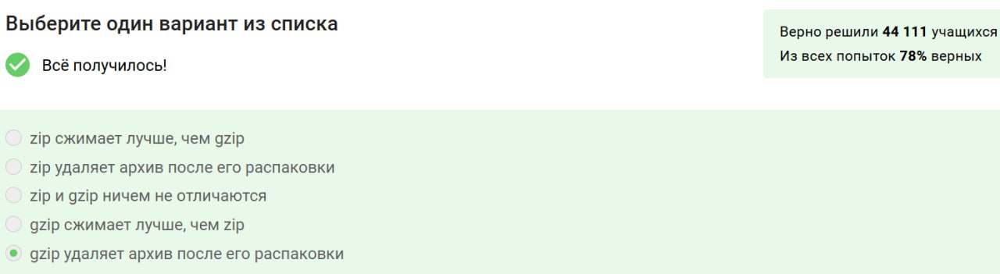{#fig:022}

Команда загружает только те файлы, которые соответствуют заданному расширению `.jpg`.

## Раздел 1.8

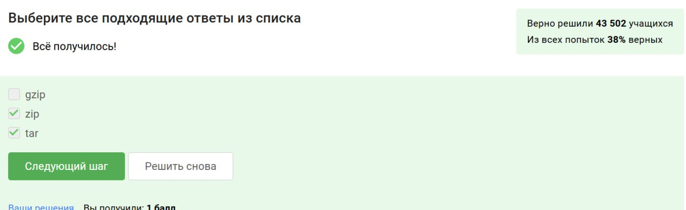{#fig:023}

Файлы, сжатые с помощью gzip, по умолчанию заменяют оригинал — в отличие от zip-архивов.

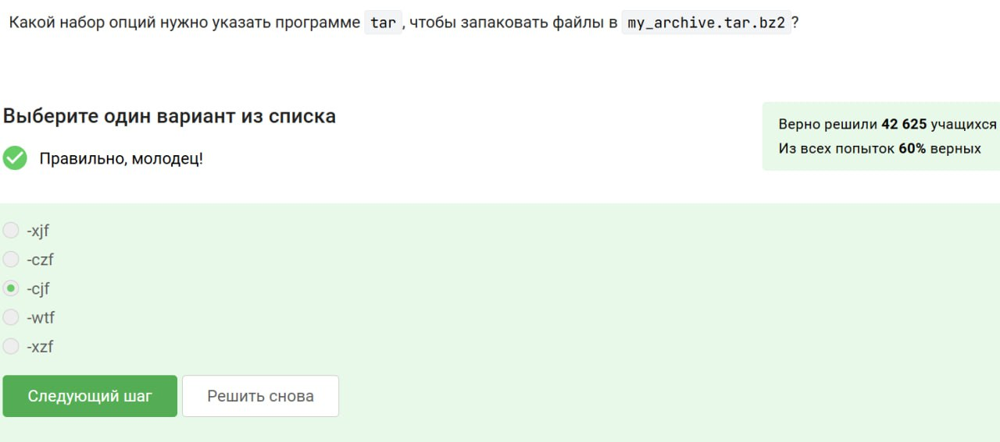{#fig:024}

Для упаковки целых директорий подходят tar и zip. Формат gzip не обладает такой возможностью.

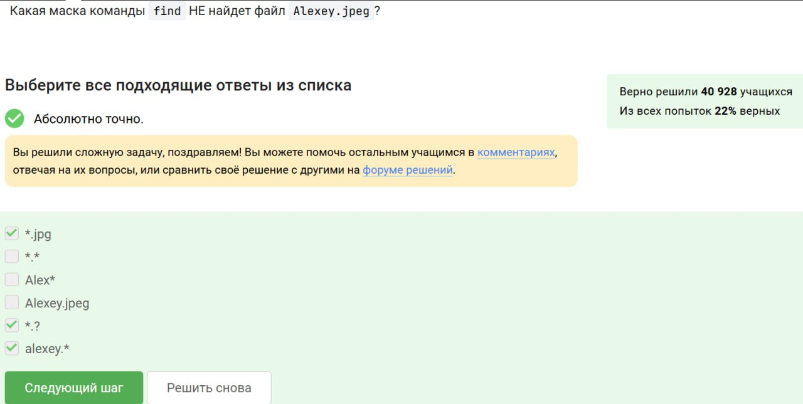{#fig:025}

Архив `.tar.bz2` создается с помощью ключей `c`, `j` и `f` — для создания, сжатия через bzip2 и указания имени файла.

## Раздел 1.9

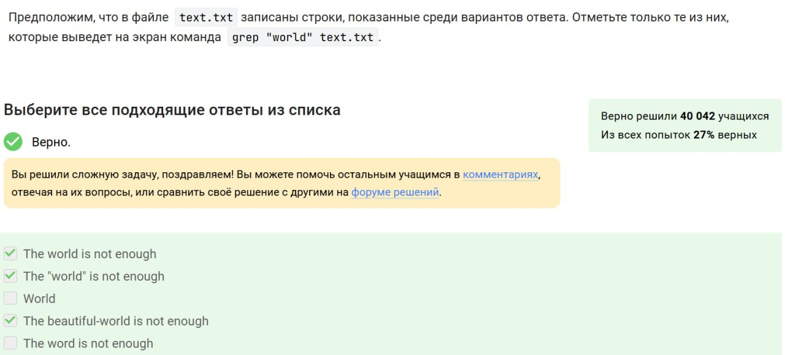{#fig:026}

Примеры масок охватывают имя файла и его расширение, учитывая разные варианты регистра.

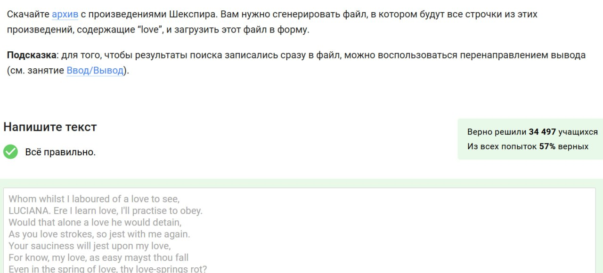{#fig:027}

Поиск с помощью `grep` чувствителен к регистру, поэтому отображаются только строки, содержащие "world" в нужной форме.

{#fig:028}

Результат поиска `grep "love"` перенаправляется в файл — это часть задания по работе с выводом.

# Выводы

Я прошла и изучила первый раздел курса по Linux на платформе Stepik.