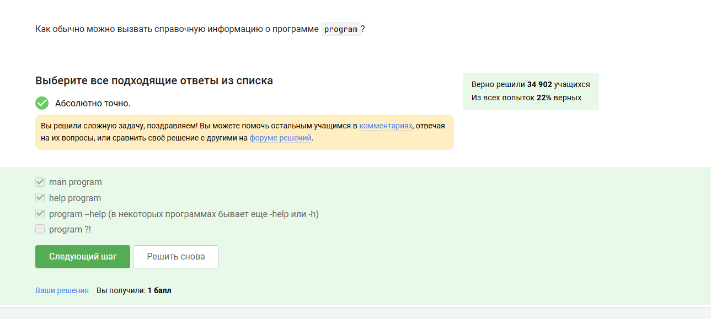

# Цель работы

Получить общее представление о системе Linux и её базовых возможностях.

# Задание

Пройти все предложенные тесты и упражнения в первом разделе курса.

# Выполнение лабораторной работы

## Скриншоты и пояснения

{#fig:001}

{#fig:002}

{#fig:003}

{#fig:004}

{#fig:005}

{#fig:006}

{#fig:007}

{#fig:008}

{#fig:009}

{#fig:010}

{#fig:011}

{#fig:012}

{#fig:013}

{#fig:014}

{#fig:015}

{#fig:016}

{#fig:017}

{#fig:018}

{#fig:019}

{#fig:020}

{#fig:021}

{#fig:022}

{#fig:023}

# Выводы

Я прошла и изучила первый раздел курса по Linux на платформе Stepik.  
Скриншоты иллюстрируют ключевые моменты работы с терминалом, процессами, утилитами и файлами в Linux-среде.  
Дополнительно изучены `tmux/trnux`, `bowtie2`, FastQC и передача данных по SSH.