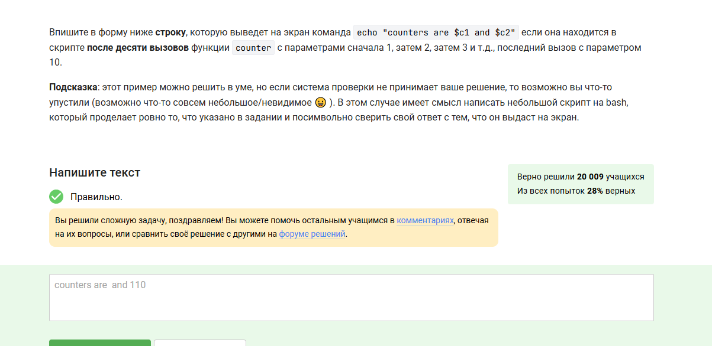

---
## Front matter
lang: ru-RU
title: "Внешний курс"
subtitle: "Выполнение внешнего курса. Основы Linux. Раздел 3"
author: 
  - Сокирка Анна Константиновна
institute: 
  - Российский университет дружбы народов, Москва, Россия
date: 	oday

## Formatting pdf
toc: false
toc-title: Содержание
slide_level: 2
aspectratio: 169
section-titles: true
theme: metropolis
header-includes:
  - \metroset{progressbar=frametitle,sectionpage=progressbar,numbering=fraction}
---

## Цель

Получить общее представление о системе Linux и её базовых возможностях.

## Задание

Пройти все предложенные тесты и упражнения в третьем разделе курса.

## Раздел 3 — Выход из Vim без сохранения

{#fig:001 width=70%}

## Раздел 3 — Замена и повторение строки в Vim

{#fig:002 width=70%}

## Раздел 3 — Замена в Vim: Windows на Linux

{#fig:003 width=70%}

## Раздел 3 — Режим Visual в Vim

{#fig:004 width=70%}

## Раздел 3 — История команд оболочки

{#fig:005 width=70%}

## Раздел 3 — Абсолютный путь к файлу

{#fig:006 width=70%}

## Раздел 3 — Примеры допустимых имен переменных

{#fig:007 width=70%}

## Раздел 3 — Вывод аргументов в скрипте

{#fig:008 width=70%}

## Раздел 3 — Условия, всегда выводящие True

{#fig:009 width=70%}

## Раздел 3 — Ошибки в скрипте с переменной

{#fig:010 width=70%}

## Раздел 3 — Условие для вывода student(s)

{#fig:011 width=70%}

## Раздел 3 — Цикл для вывода start и finish

{#fig:012 width=70%}

## Раздел 3 — Ввод имени и возраста, определение возрастной группы

{#fig:013 width=70%}

## Раздел 3 — Увеличение переменной

{#fig:014 width=70%}

## Раздел 3 — Команда echo для вывода звёздочки

{#fig:015 width=70%}

## Раздел 3 — Результат выполнения 10 вызовов счетчика

{#fig:016 width=70%}

## Раздел 3 — Нахождение НОД по алгоритму Евклида

{#fig:017 width=70%}

## Раздел 3 — Ошибки в калькуляторе

{#fig:018 width=70%}

## Раздел 3 — Разница между find -iname и -name

{#fig:019 width=70%}

## Раздел 3 — Разница между -path и -name в find

{#fig:020 width=70%}

## Раздел 3 — Поиск с -mindepth 2 и -maxdepth 3

{#fig:021 width=70%}

## Раздел 3 — Команды grep -A и -B

{#fig:022 width=70%}

## Раздел 3 — grep с шаблоном для строк с заглавными буквами

{#fig:024 width=70%}

## Раздел 3 — Замена двух заглавных букв на 'abbreviation'

{#fig:025 width=70%}

## Раздел 3 — Опции gnuplot для сохранения графиков

{#fig:026 width=70%}

## Раздел 3 — Визуализация данных в gnuplot

{#fig:027 width=70%}

## Раздел 3 — Подтверждение и статистика в gnuplot

{#fig:028 width=70%}

## Раздел 3 — Инструкция по зеркальному отражению графика в gnuplot

{#fig:029 width=70%}

## Раздел 3 — Множественный выбор в тесте

{#fig:030 width=70%}

## Раздел 3 — Команда для размера директории

{#fig:031 width=70%}

## Раздел 3 — Создание нескольких директорий одной командой

{#fig:032 width=70%}

## Выводы

Я прошла и изучила третий раздел курса по Linux на платформе Stepik.  
Скриншоты иллюстрируют ключевые моменты работы с терминалом, процессами, утилитами и файлами в Linux-среде.  
Дополнительно изучены команды `find`, `grep`, работа с графиками в `gnuplot`, а также использование переменных и циклов в скриптах.